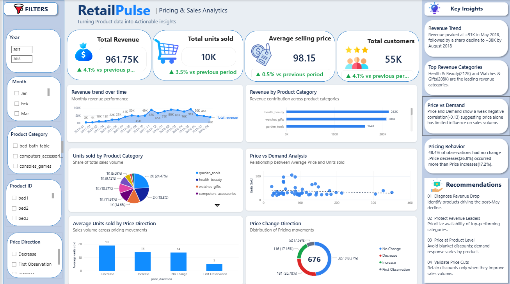

# 📊 RetailPulse | Pricing & Sales Analytics

> End-to-End Retail Pricing Analytics using Python, SQL & Power BI

## 📌 Project Overview

RetailPulse is an end-to-end retail analytics project that analyzes
product pricing, revenue performance, sales volume and demand patterns.

The project combines Python for data exploration and validation, SQL for
business analysis, and Power BI for data modeling, DAX calculations and
interactive visualization.

The objective is to convert historical product-level data into actionable
pricing and sales insights.

---

## 📊 Dashboard Preview

---

## 🎯 Business Questions

This project aims to answer:

- How does revenue change over time?
- Which product categories generate the most revenue?
- Which categories drive the highest sales volume?
- How frequently are product prices changed?
- Is product price associated with demand?
- How does sales volume differ across pricing movements?

---

## 🛠️ Tools & Technologies

| Tool | Purpose |
|------|---------|
| Python | Data exploration and validation |
| Pandas | Data cleaning and analysis |
| SQL | Business analysis and querying |
| Power Query | Data transformation |
| Power BI | Dashboard development |
| DAX | KPIs and time-intelligence calculations |

---

## 🔄 Project Workflow

Raw Data
   ↓
Python Data Exploration & Validation
   ↓
Data Cleaning
   ↓
SQL Analysis
   ↓
Power Query
   ↓
Power BI Data Model
   ↓
DAX Measures
   ↓
Interactive Dashboard
   ↓
Business Insights & Recommendations

---

## 📈 Dashboard Features

### KPIs
- Total Revenue
- Total Units Sold
- Average Selling Price
- Total Customers

### Analysis
- Revenue Trend Over Time
- Revenue by Product Category
- Units Sold by Product Category
- Price vs Demand Analysis
- Average Units Sold by Price Direction
- Price Change Direction

### Interactive Filters
- Year
- Month
- Product Category
- Product ID
- Price Change Direction

---

## 🔍 Key Insights

- Revenue peaked at approximately **91K in May 2018** before declining
  to approximately **38K by August 2018**.

- **Health & Beauty (~212K)** and **Watches & Gifts (~208K)** were the
  highest revenue-generating categories.

- Price and demand showed a **weak negative correlation (-0.13)**,
  indicating that price alone has limited association with sales volume.

- **48.4%** of observations recorded no price change, while price
  decreases (**26.8%**) occurred more frequently than increases (**17.2%**).

---

## 💡 Business Recommendations

**1. Diagnose Revenue Drop**  
Identify products driving the post-May revenue decline.

**2. Protect Revenue Leaders**  
Prioritize availability of top-performing categories.

**3. Price at Product Level**  
Avoid blanket discounts; demand response varies by product.

**4. Validate Price Cuts**  
Retain discounts only when they improve sales volume.

---

## 🧹 Data Validation

The dataset contains **676 product-month observations**.

During analysis, 29 lag-price mismatches were identified. Investigation
showed that all occurred where product observations were separated by
more than one month.

Therefore, consecutive-month pricing analysis was restricted to
observations where `month_gap = 1`.

This validation prevents non-consecutive observations from being
incorrectly interpreted as normal month-to-month price changes.

---

## 📂 Repository Structure

RetailPulse/
│
├── data/
│   └── retailpulse_mysql.csv
│
├── notebooks/
│   └── RetailPulse_Analysis.ipynb
│
├── sql/
│   └── RetailPulse_SQL_Analysis.sql
│
├── powerbi/
│   └── RetailPulse_Dashboard.pbix
│
├── images/
│   └── retailpulse_dashboard.png
│
└── README.md

---

## 🖥️ How to View the Power BI Dashboard

1. Download `RetailPulse_Dashboard.pbix`.
2. Open the file using Microsoft Power BI Desktop.
3. Select **View → Page view → Fit to page**.
4. Use the slicers on the left side to interact with the dashboard.

If Power BI Desktop is not installed, the dashboard can still be viewed
using the screenshot included in the `images` folder.

---

## 📌 Skills Demonstrated

`Python` `Pandas` `SQL` `Power BI` `Power Query` `DAX`
`EDA` `Data Validation` `Data Modeling` `Pricing Analytics`
`Business Intelligence` `Data Visualization`

---

## 👤 Author

**Arsheen Ara**

Data Analytics Portfolio Project